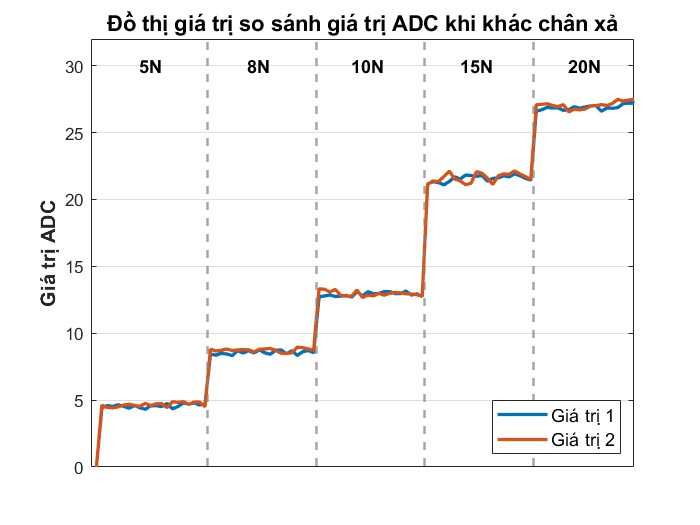
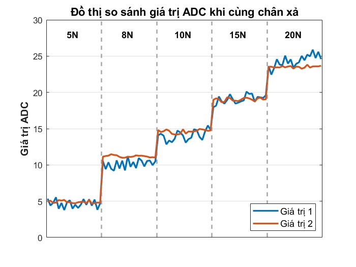
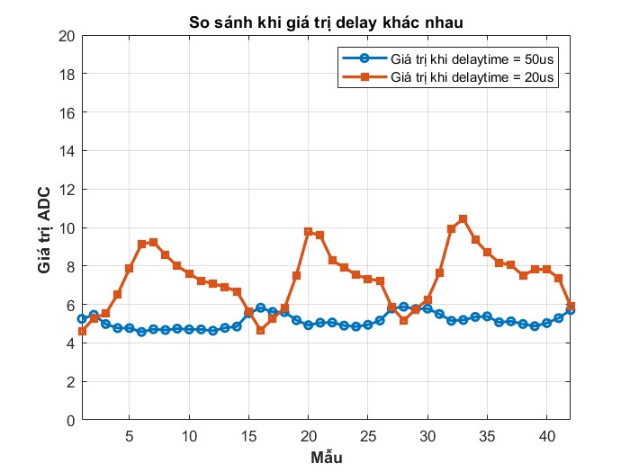
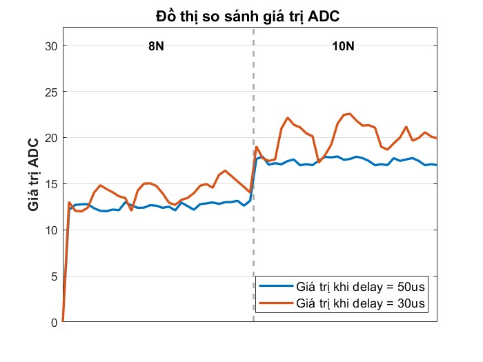
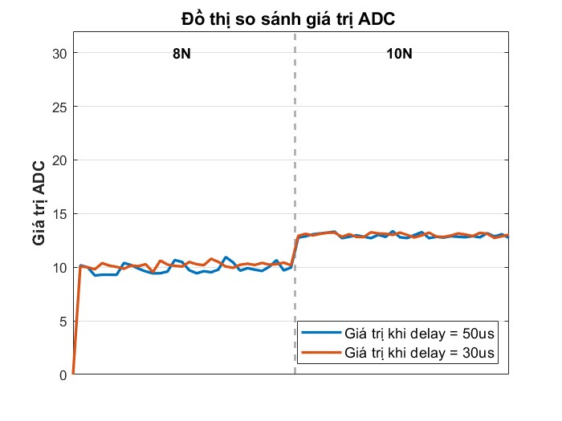

# Báo cáo tiến độ nghiên cứu ngày 15/08/2026
## A. Công việc đã làm
- So sánh giá trị khi sử dụng chung 1 chân xả
- Khảo sát giá trị delay_time
- Tìm hiểu nguyên lí và Vẽ mạch tích hợp stm32 cho cảm biến
## B. Khó Khăn
## C. Báo cáo chi tiết 
### 1. So sánh giá trị khi chung chân xả
#### Code main:
```cpp
#include <Arduino.h>
#include "ADCTouchSensor.h"

ADCTouchSensor pressure1(PA0, PA1, 50);
ADCTouchSensor pressure2(PA3, PA1, 50);

float Ref1 = 0, Ref2 = 0;
const unsigned int SAMPLES = 100; 

void setup() {
  Serial.begin(115200);           
  delay(2000); 
  analogReadResolution(12); 
  Ref1= pressure1.readRaw(300);
  Ref2 = pressure2.readRaw(300);
}

void loop() {
  unsigned int T1 = micros();
  float raw1 = pressure1.readRaw(SAMPLES);
  unsigned int T2 = micros();
  float raw2 = pressure2.readRaw(SAMPLES);
  unsigned int T3 = micros();
  unsigned int T_1 = T2 - T1;
  unsigned int T_2= T3 - T2;
  float value1 = raw1 - Ref1;
  float value2 = raw2 - Ref2;
  Serial.print(value1);
  Serial.print("  ");
  Serial.print(value2);
  Serial.print("  ");
  Serial.print(T_1);
  Serial.print("  ");
  Serial.println(T_2);
  delay(1000);
}
```
#### Đồ thị kết quả khi khác chân xả
<div align="center">



</div>

#### Đồ thị kết quả khi chung chân xả
<div align="center">



</div>

#### Nhận xét:
- Khi chung chân xả, tụ được đo trước sẽ duy trì giá trị ADC gần như là cố định, còn tụ đo sau giá trị sẽ không duy trì ở mức ổn định.

### 2. Thời gian delay_time
#### Delay_default:
##### Trong file header:
```cpp
#ifndef ADCTOUCHSENSOR_h
#define ADCTOUCHSENSOR_h

#include "Arduino.h"

#if defined(ARDUINO_GENERIC_STM32F103C) 
# define ADCTOUCH_STM32_GROUND_CHANNEL  15 
# define ADCTOUCH_STM32_ADC             ADC1
# define ADCTOUCH_INTERNAL_GROUNDING
#endif

#if defined(ARDUINO_ARCH_AVR)
# define ADCTOUCH_INTERNAL_GROUNDING
# define INPUT_ANALOG INPUT
#endif

// Kiểm tra nếu là kiến trúc STM32 nói chung
#if defined(ARDUINO_ARCH_STM32) || defined(ARDUINO_GENERIC_STM32F103C) || defined(ARDUINO_ARCH_STM32F1)
  #define ADCTOUCH_DEFAULT_DELAY 20
  #define ADCTOUCH_DIVIDER        4
// Kiểm tra nếu là kiến trúc AVR (Uno, Nano...)
#elif defined(ARDUINO_ARCH_AVR)
  #define ADCTOUCH_DEFAULT_DELAY 0
  #define ADCTOUCH_DIVIDER        1
// Nếu là các board khác (phòng hờ) thì vẫn cho giá trị mặc định để khỏi lỗi
#else
  #define ADCTOUCH_DEFAULT_DELAY 20
  #define ADCTOUCH_DIVIDER        1
#endif

class ADCTouchSensor
{
    private:
        float reference;
        int groundedPin;
        int touchPin;
        int touchDigitalPin;
        unsigned delayTime;
        bool valid;

    private:
        void groundPortable();
#ifdef ADCTOUCH_INTERNAL_GROUNDING        
        void ground();
#endif
    
	public:
        ADCTouchSensor(int pin, int sacrificialPin=-1, unsigned delayTimeMicroseconds=ADCTOUCH_DEFAULT_DELAY);
        bool begin(unsigned samples=500);
        float read(unsigned samples = 5);
        float readRaw(unsigned samples = 5);
        float readRaw_new(unsigned samples = 5);
        float readRaw_new_2(unsigned samples = 5);
        float readRaw_new_3(unsigned samples = 5);
        int readRaw1();
        int readRaw1_new();
        int readRaw1_new_2();
        int readRaw1_new_3();
};
#endif
```
=> Giá trị delaytime được định nghĩa bằng 20us đối với dòng STM32.
##### Giá trị khi so sánh giá trị ADC với delaytime = 50us và 20us:
- Hàm main:
```cpp
#include <Arduino.h>
#include "ADCTouchSensor.h"

ADCTouchSensor pressure1(PA0, PA1, 50);
ADCTouchSensor pressure2(PA3, PA2);

float Ref1 = 0, Ref2 = 0;
const unsigned int SAMPLES = 100; 

void setup() {
  Serial.begin(115200);           
  delay(2000); 

  analogReadResolution(12); 
  Ref1= pressure1.readRaw(300);
  Ref2 = pressure2.readRaw(300);
  
}

void loop() {
  unsigned int T1 = micros();
  float raw1 = pressure1.readRaw(SAMPLES);
  unsigned int T2 = micros();
  float raw2 = pressure2.readRaw(SAMPLES);
  unsigned int T3 = micros();
  unsigned int T_1 = T2 - T1;
  unsigned int T_2= T3 - T2;
  float value1 = raw1 - Ref1;
  float value2 = raw2 - Ref2;
  Serial.print(value1);
  Serial.print("  ");
  Serial.print(value2);
  Serial.print("  ");
  Serial.print(T_1);
  Serial.print("  ");
  Serial.println(T_2);
  delay(1000);
}
```
- Đồ thị so sánh 2 giá trị với cùng 1 mức lực:
<div align="center">



</div>

##### Nhận xét:
- Giá trị ADC tại thời điểm delaytime = 50us ổn định ở mức 5-6.
- Giá trị ADC tại thời điểm delaytime = 20us các giá trị thay đổi không có quy luật.

#### Giá trị delaytime bằng 30us:
- Hàm main:
```cpp
#include <Arduino.h>
#include "ADCTouchSensor.h"

ADCTouchSensor pressure1(PA0, PA1, 50);
ADCTouchSensor pressure2(PA3, PA2, 30);

float Ref1 = 0, Ref2 = 0;
const unsigned int SAMPLES = 100; 

void setup() {
  Serial.begin(115200);           
  delay(2000); 

  analogReadResolution(12); 
  Ref1= pressure1.readRaw(300);
  Ref2 = pressure2.readRaw(300);
  
}

void loop() {
  unsigned int T1 = micros();
  float raw1 = pressure1.readRaw(SAMPLES);
  unsigned int T2 = micros();
  float raw2 = pressure2.readRaw(SAMPLES);
  unsigned int T3 = micros();
  unsigned int T_1 = T2 - T1;
  unsigned int T_2= T3 - T2;
  float value1 = raw1 - Ref1;
  float value2 = raw2 - Ref2;
  Serial.print(value1);
  Serial.print("  ");
  Serial.print(value2);
  Serial.print("  ");
  Serial.print(T_1);
  Serial.print("  ");
  Serial.println(T_2);
  delay(1000);
}
```
- Đồ thị so sánh giá trị ADC với 2 giá trị delay:
<div align="center">



</div>

##### Nhận xét:
- Giá trị ADC ở 50us duy trì ổn định:
- Giá trị ADC ở 30us vẫn bị thay đổi không theo quy luật:

#### Giá trị delaytime bằng 40us:
- Hàm main:
```cpp
#include <Arduino.h>
#include "ADCTouchSensor.h"

ADCTouchSensor pressure1(PA0, PA1, 50);
ADCTouchSensor pressure2(PA3, PA2, 40);

float Ref1 = 0, Ref2 = 0;
const unsigned int SAMPLES = 100; 

void setup() {
  Serial.begin(115200);           
  delay(2000); 

  analogReadResolution(12); 
  Ref1= pressure1.readRaw(300);
  Ref2 = pressure2.readRaw(300);
  
}

void loop() {
  unsigned int T1 = micros();
  float raw1 = pressure1.readRaw(SAMPLES);
  unsigned int T2 = micros();
  float raw2 = pressure2.readRaw(SAMPLES);
  unsigned int T3 = micros();
  unsigned int T_1 = T2 - T1;
  unsigned int T_2= T3 - T2;
  float value1 = raw1 - Ref1;
  float value2 = raw2 - Ref2;
  Serial.print(value1);
  Serial.print("  ");
  Serial.print(value2);
  Serial.print("  ");
  Serial.print(T_1);
  Serial.print("  ");
  Serial.println(T_2);
  delay(1000);
}
```
- Đồ thị so sánh giá trị ADC với 2 giá trị delay:
<div align="center">



</div>

##### Nhận xét:
- Giá trị ADC ở 2 trường hợp delay khác nhau cho ra kết quả gần như là giống nhau.

### 3. Tay gắp
#### Phần tay gắp do bánh răng chưa khít và yếu, quá trình thử nghiệm bị gãy nên phải thiết kế và in lại, phần này sẽ báo cáo tiếp vào tuần tới

### 4, Mạch tích hợp stm32
- Phần schematic và 3d của mạch:
<https://drive.google.com/file/d/15TNZNe-ty2ycXfJIeD7c3b5nuHwRd6_J/view>
- Phần thiết kế mạch chi tiết:
<https://drive.google.com/file/d/15TNZNe-ty2ycXfJIeD7c3b5nuHwRd6_J/view>